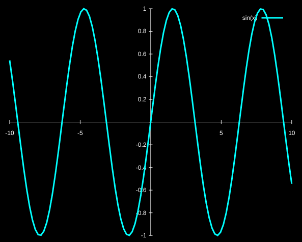

# Obsidian GnuPlot Plugin

This is a very barebones plugin for drawing plots in obsidian simply by
inserting code blocks like so:

````
```plot
plot sin(x)
```
````

When you switch to viewer mode, the plugin runs the gnuplot binary and displays
the resulting plot as an image.

The text within the code block is executed as-is within gnuplot. The plugin first runs
a predefined set of commands in order to make the resulting plot look better.

You can tweak with the initialization commands and change the path of the gnuplot
binary in your settings.

The following is the init commands I use and an example plot generated with it:

```
set terminal svg enhanced background rgb 'white'

set xzeroaxis
set yzeroaxis
set zzeroaxis

set border 0
set xtics axis
set ytics axis

set xtics add ("" 0)
set ytics add ("" 0)

set tics scale 0.4

set style line 50 lt 1 lc rgb "white" lw 1
set key textcolor rgb "white"

set border ls 50
set xzeroaxis ls 50
set yzeroaxis ls 50
```

Inserting 

````
```plot
plot sin(x) ls 1
````

into obsidian displays this image:



## ⚠️  Contributions
This is a very barebones plugin and all it essentially does is run a seperate
gnuplot binary and insert its output to the preview screen. It works, but it
can definitely use some work. I am VERY open to contributions/improvements on
it so please feel free to send a pull request.
